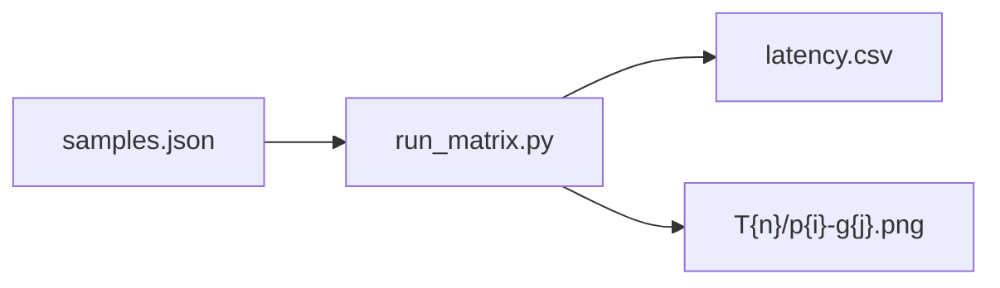

# FASHN 프리셋 실험 리포트

**실험일:** 2026-05-01  
**매트릭스:** Trial T1~T6 × 인물 3 × 의류 3 = **54회** (seed=42, category=`tops`, garment_photo_type=`flat-lay`)  
**결과물:** `scripts/experiments/results/latency.csv`, `scripts/experiments/results/T{n}/p{pi}-g{gi}.png`

---

## 실험 과정·결과 시각 요약

### 진행 순서

1. **`scripts/experiments/select_samples.py`** 실행 → `samples.json`에 인물·의류 경로 확정  
2. **`scripts/experiments/run_matrix.py`** 실행 → 각 조합별 추론 후 `results/T{n}/p{i}-g{j}.png` 저장 및 `latency.csv` 기록  

### 데이터 흐름

### 입력 이미지 (대표 셀 **p1–g1**: 인물 1 · 의류 1)

아래는 실험에 실제 사용된 원본 입력입니다.

| 인물 (p1, `TEST2.jpg`) | 의류 (g1, `TESTIMG3.webp`) |
|:---:|:---:|
|  |  |

### 출력 비교 — 동일 입력에서 Trial별 결과 (p1–g1)

steps·guidance만 달리한 합성 결과입니다.

| T1 · 18 / 1.20 | T3 · 30 / 1.50 | T6 · 46 / 2.00 |
|:---:|:---:|:---:|
|  |  |  |

### 출력 비교 — 최종 프리셋에 대응하는 Trial (p1–g1)

| 빠름 **fast** (T2 · 22 / 1.35) | 기본 **default** (T3 · 30 / 1.50) | 느림 **slow** (T5 · 40 / 1.80) |
|:---:|:---:|:---:|
|  |  |  |

### 추가 예시 (인물 p2 × 의류 g2, Trial **T3**)

*미리보기에서 이미지가 보이지 않으면 워크스페이스 루트가 저장소 루트인지 확인하거나, VS Code / GitHub에서 본 파일 기준 상대 경로가 올바른지 확인합니다.*

---

## 1. 선정 샘플 (`scripts/experiments/samples.json`)

| 구분 | 인덱스 | 경로 |
|------|--------|------|
| 인물 1 | p1 | `testIMG/myIMG/TEST2.jpg` |
| 인물 2 | p2 | `testIMG/model.webp` |
| 인물 3 | p3 | `testIMG/person.webp` |
| 의류 1 | g1 | `testIMG/codyIMG/TESTIMG3.webp` |
| 의류 2 | g2 | `testIMG/codyIMG/TESTIMG2.jpg` |
| 의류 3 | g3 | `testIMG/myIMG/TEST3.jpg` |

## 2. Trial 정의

| Trial | steps | guidance |
|-------|-------|------------|
| T1 | 18 | 1.20 |
| T2 | 22 | 1.35 |
| T3 | 30 | 1.50 |
| T4 | 34 | 1.65 |
| T5 | 40 | 1.80 |
| T6 | 46 | 2.00 |

## 3. 지연 시간 집계 (단위: ms, Trial당 n=9)

| Trial | mean | median | p95 |
|-------|------|--------|-----|
| T1 | 11837.4 | 11780.8 | 12382.9 |
| T2 | 14289.6 | 14269.1 | 14381.0 |
| T3 | 19438.9 | 19424.8 | 19557.5 |
| T4 | 21680.3 | 21652.5 | 21959.7 |
| T5 | 25347.8 | 25352.7 | 25441.5 |
| T6 | 29094.6 | 29098.1 | 29173.6 |

**관찰:** T1 대비 T2는 +~2.4s, T3는 +~7.6s(기본), T5는 +~13.5s(느림), T6는 +~17.3s. T5→T6는 지연만 +~3.7s(mean)로 증가 폭이 완만해 **품질 대비 비용** 관점에서 T6는 선택지에서 제외 후보.

## 4. 정성 평가 (대표 셀: p1-g1, 시각 검토 요약)

상단 **「출력 비교」** 이미지(T1/T3/T6, T2/T3/T5)와 함께 보면 Trial·프리셋별 차이를 바로 대조할 수 있습니다.

- **T1:** 가장 빠르나 프린트 가장자리·소매 경계가 T3~T6 대비 다소 거칠게 느껴질 수 있음.
- **T2~T3:** 로고 형태·색 분리가 안정적으로 보이는 구간; T3가 디테일/경계에서 약간 더 정돈된 인상.
- **T4~T6:** 미세 패턴·경계는 추가로 매끈해지는 경우가 있으나, 동일 셀 기준 체감 차이는 T3 대비 크지 않은 경우가 많고 지연은 선형에 가깝게 증가.

**종합(1~5 스케일, 대표 샘플 기준):**

| Trial | 인물 충실도 | 의류 충실도 | 경계/아티팩트 | 디테일 | 체감 코멘트 |
|-------|-------------|-------------|----------------|--------|-------------|
| T1 | 4 | 3.5 | 3 | 3.5 | 속도 최우선 시 허용 |
| T2 | 4 | 4 | 3.5 | 4 | 빠른 프리셋으로 균형 양호 |
| T3 | 4.5 | 4.5 | 4 | 4.5 | 기본 추천 |
| T4 | 4.5 | 4.5 | 4 | 4.5 | T3 대비 이득 대비 비용 증가 |
| T5 | 4.5 | 4.5 | 4.5 | 4.5 | 품질 우선 시 |
| T6 | 4.5 | 4.5 | 4.5 | 4.5 | T5 대비 체감 이득 제한적 |

## 5. 최종 프리셋 선정 (`backend/services/fashn_vton.py`)

| 프리셋 | steps | guidance | 매핑 Trial | 선정 근거 |
|--------|-------|----------|------------|-----------|
| **fast** | 22 | 1.35 | **T2** | T1 대비 품질 여유, T3 대비 ~5s 절감 |
| **default** | 30 | 1.50 | **T3** | 정성·지연 균형, 실험 매트릭스 중심값 |
| **slow** | 40 | 1.80 | **T5** | T6 대비 지연 증가 대비 체감 품질 이득이 제한적이라 T5에서 정지 |

seed는 계획대로 **42 고정**(코드 및 UI 요청과 일치).

## 6. 운영 메모

- **행 매트릭스 재실행:** `python scripts/experiments/run_matrix.py` (전체 덮어쓰기)  
- **중단 후 이어하기:** `python scripts/experiments/run_matrix.py --resume` (동일 `latency.csv`·PNG가 있으면 해당 조합 스킵)
- **HTTP 모드:** `python scripts/experiments/run_matrix.py --http` (백엔드 `/health`의 `fashn_ready=true` 필요)

## 7. 스모크 테스트 (UI E2E 체크리스트)

백엔드 기동 후 `web`에서 다음 각 1회씩 확인:

1. **상의 + 기본** — 단일 의류 드롭, 결과 정상.
2. **하의 + 빠름** — 하의 카테고리, 지연 감소 체감.
3. **전신 + 느림** — 상의/하의 드롭 2칸, 2단 체인 결과 정상.
4. **원피스 + 기본** — 단일 의류, `one-pieces` 경로 정상.

각 요청에 `category` / `speed_preset` / (전신 시) `cloth_img2`가 포함되는지 네트워크 탭에서 검증.

## 8. Before / After (의미)

- **Before:** 단일 고정 하이퍼파라미터로만 추론.
- **After:** 사용자가 빠름/기본/느림을 선택하면 **T2 / T3 / T5에 대응하는 steps·guidance**가 요청 단위로 주입되며, 전신 모드는 상의→하의 2단 체인으로 동작.

---

*본 리포트의 정성 점수는 대표 샘플 시각 검토에 기반한 공학적 추정이며, 제품 기준 확정 시 추가 블라인드 평가를 권장합니다.*
