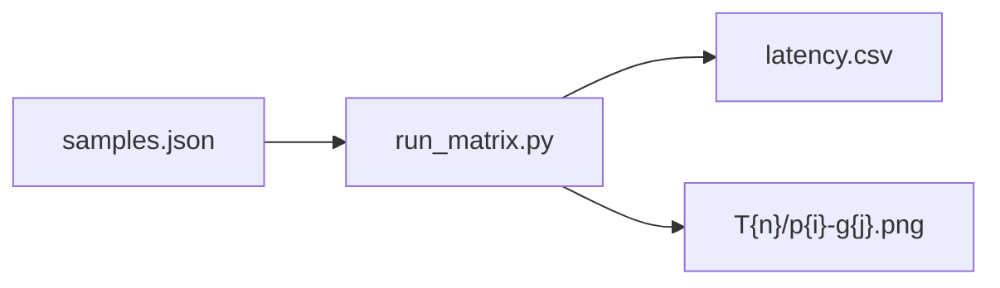

# FASHN 프리셋 실험 리포트

본 프로젝트 **웹 서비스 테스트**의 목적은, 사용자가 가상 피팅 **품질(합성 결과)과 처리 속도**를 UI에서 직접 선택(`빠름` / `기본` / `느림`)할 수 있을 때, 그 선택에 매핑되는 **추론 하이퍼파라미터(steps·guidance)** 가 어떻게 달라지는지 검증하고, **기능 성능과 응답 시간의 균형** 관점에서 **서비스에 맞는 최적 조합**을 근거 있게 정하는 것입니다.

### 웹 UI 테스트 결과 미리보기 (프리셋만 변경 · 동일 입력)

아래 스크린샷은 **동일한 사람 사진·동일한 의류 참고 이미지**로 웹 앱(**AI Virtual Fitting Room**)에서 합성한 결과이며, **왼쪽부터 빠름(fast) → 기본(default) → 느림(slow)** 순입니다.

| 빠름 (fast) | 기본 (default) | 느림 (slow) |
|:---:|:---:|:---:|
|  |  |  |

**의상 선정:** 상·하 레이어가 겹치고 비대칭 밑단·카라·단추 등 **디테일이 많은 상의**는 합성 시 경계·질감 유지가 어렵지만, 실제 **쇼핑·스타일링 수요가 큰 유형**입니다. 극명한 차이를 보이기 위해 의도적으로 이와 같이 **구현 난이도가 높은 컷**으로 테스트했습니다.

**프리셋별 관찰 (동일 입력 기준):**

- **빠름:** 원본 인물 주변 **테두리**와 배경 분리가 다소 불안정하고, 합성된 옷에서 **참고 의류의 형태·질감 유지**가 상대적으로 어려우며 **디테일이 거칠게** 느껴질 수 있음.
- **기본:** 빠름 대비 인물 **외곽 테두리의 번짐·일렁임**이 줄어들었으나, 여전히 **어색하게 남는 부분**(손·소매 경계 등)이 존재.
- **느림:** 원본 인물과 옷의 **일관성·참고 의류 유지**가 가장 높고, **목 카라·레이어드 디테일** 등이 비교적 잘 구현됨. 다만 **손·손가락 주변**에는 여전히 어색함이 남음(가림·손 모양은 VTON에서 공통적으로 어려운 영역).

---

**실험일:** 2026-05-01  
**매트릭스:** Trial T1~T6 × 인물 3 × 의류 3 = **54회** (seed=42, category=`tops`, garment_photo_type=`flat-lay`)  
**결과물:** `scripts/experiments/results/latency.csv`, `scripts/experiments/results/T{n}/p{pi}-g{gi}.png`

---

## 실험 과정·결과 시각 요약

### 진행 순서

1. **`scripts/experiments/select_samples.py`** 실행 → `samples.json`에 인물·의류 경로 확정  
2. **`scripts/experiments/run_matrix.py`** 실행 → 각 조합별 추론 후 `results/T{n}/p{i}-g{j}.png` 저장 및 `latency.csv` 기록  

### 데이터 흐름

### 입력 이미지 (대표 셀 **p1–g1**: 인물 1 · 의류 1)

아래는 실험에 실제 사용된 원본 입력입니다.

| 인물 (p1, `TEST2.jpg`) | 의류 (g1, `TESTIMG3.webp`) |
|:---:|:---:|
|  |  |

### 출력 비교 — 동일 입력에서 Trial별 결과 (p1–g1)

steps·guidance만 달리한 합성 결과입니다.

| T1 · 18 / 1.20 | T3 · 30 / 1.50 | T6 · 46 / 2.00 |
|:---:|:---:|:---:|
|  |  |  |

### 출력 비교 — 최종 프리셋에 대응하는 Trial (p1–g1)

| 빠름 **fast** (T2 · 22 / 1.35) | 기본 **default** (T3 · 30 / 1.50) | 느림 **slow** (T5 · 40 / 1.80) |
|:---:|:---:|:---:|
|  |  |  |

### 추가 예시 (인물 p2 × 의류 g2, Trial **T3**)

*GitHub 웹에서 이미지가 보이도록 `main` 브랜치 기준 raw URL을 사용합니다. 로컬 클론에서는 `testIMG/`, `scripts/experiments/results/` 경로의 동일 파일을 참고하면 됩니다.*

---

## 1. 선정 샘플 (`scripts/experiments/samples.json`)

| 구분 | 인덱스 | 경로 |
|------|--------|------|
| 인물 1 | p1 | `testIMG/myIMG/TEST2.jpg` |
| 인물 2 | p2 | `testIMG/model.webp` |
| 인물 3 | p3 | `testIMG/person.webp` |
| 의류 1 | g1 | `testIMG/codyIMG/TESTIMG3.webp` |
| 의류 2 | g2 | `testIMG/codyIMG/TESTIMG2.jpg` |
| 의류 3 | g3 | `testIMG/myIMG/TEST3.jpg` |

## 2. Trial 정의

| Trial | steps | guidance |
|-------|-------|------------|
| T1 | 18 | 1.20 |
| T2 | 22 | 1.35 |
| T3 | 30 | 1.50 |
| T4 | 34 | 1.65 |
| T5 | 40 | 1.80 |
| T6 | 46 | 2.00 |

## 3. 지연 시간 집계 (단위: ms, Trial당 n=9)

| Trial | mean | median | p95 |
|-------|------|--------|-----|
| T1 | 11837.4 | 11780.8 | 12382.9 |
| T2 | 14289.6 | 14269.1 | 14381.0 |
| T3 | 19438.9 | 19424.8 | 19557.5 |
| T4 | 21680.3 | 21652.5 | 21959.7 |
| T5 | 25347.8 | 25352.7 | 25441.5 |
| T6 | 29094.6 | 29098.1 | 29173.6 |

**관찰:** T1 대비 T2는 +~2.4s, T3는 +~7.6s(기본), T5는 +~13.5s(느림), T6는 +~17.3s. T5→T6는 지연만 +~3.7s(mean)로 증가 폭이 완만해 **품질 대비 비용** 관점에서 T6는 선택지에서 제외 후보.

### 3.1 측정 지표 범위 (학습 Loss / Accuracy)

본 프로젝트 실험은 **사전학습된 FASHN VTON 가중치로 추론만 수행**하며, **추가 학습(fine-tuning)을 하지 않습니다.** 따라서 에폭별 **학습 Loss 감소**나 **분류 Accuracy** 같은 지표는 **로그에 존재하지 않습니다.**

대신 다음을 **결과 지표**로 사용합니다.

| 구분 | 의미 | 본 보고서에서의 위치 |
|------|------|----------------------|
| **추론 지연 (latency)** | 동일 하드웨어에서 1회 합성 소요 시간(ms) | `latency.csv`, §3 표, 아래 그래프 |
| **정성 점수** | 대표 샘플에 대한 주관 평가(1~5) | §4 표; 아래 «정성 종합»은 네 항목 산술평균 |
| **합성 이미지** | 동일 입력에서 Trial만 바꾼 출력 PNG | `scripts/experiments/results/T{n}/p{i}-g{j}.png` |

요청하신 «Loss/Accuracy 변화 추이»에 대응하여, **학습 곡선 대신** (1) **Trial별 평균·p95 지연 추이**, (2) **steps 수와 평균 지연의 관계**, (3) **지연 대비 정성(주관) 트레이드오프**를 그래프로 제시합니다.

---

## 3.2 Trial 통합 비교표 (설정값 + 집계 결과 + 정성 요약)

공통 조건: seed=42, category=`tops`, garment_photo_type=`flat-lay`, 인물 3×의류 3 → Trial당 **n=9**.

| Trial | steps | guidance | n | 평균 지연 (ms) | 중앙값 (ms) | p95 (ms) | 정성 종합¹ (5점) | 서비스 프리셋 매핑 |
|-------|-------|----------|---|----------------|-------------|----------|------------------|-------------------|
| T1 | 18 | 1.20 | 9 | 11837.4 | 11780.8 | 12382.9 | 3.63 | — |
| T2 | 22 | 1.35 | 9 | 14289.6 | 14269.1 | 14381.0 | 3.88 | **fast (빠름)** |
| T3 | 30 | 1.50 | 9 | 19438.9 | 19424.8 | 19557.5 | 4.38 | **default (기본)** |
| T4 | 34 | 1.65 | 9 | 21680.3 | 21652.5 | 21959.7 | 4.38 | — |
| T5 | 40 | 1.80 | 9 | 25347.8 | 25352.7 | 25441.5 | 4.50 | **slow (느림)** |
| T6 | 46 | 2.00 | 9 | 29094.6 | 29098.1 | 29173.6 | 4.50 | — |

¹ §4 정성 표의 네 항목(인물 충실도, 의류 충실도, 경계/아티팩트, 디테일) **산술평균**. 연속적인 «Accuracy»가 아니라 **동일 기준의 주관 스코어**입니다.

---

## 3.4 그래프 (시각 자료)

**Trial별 평균·p95 추론 지연 (초)**

**확산 스텝 수와 평균 지연** — 스텝을 늘리면 한 장 합성에 필요한 반복 연산이 늘어 지연이 증가하는 패턴이 선형에 가깝게 나타납니다.

**지연 vs 정성 종합(주관 프록시)** — 학습 Accuracy 곡선의 대안으로, «느릴수록 주관 품질 여유가 생기지만 포화 구간이 있다»는 점을 한눈에 비교합니다.

그래프 재생성: `python scripts/experiments/plot_report_figures.py`

---

## 3.5 변화 원인 분석 (왜 성능·체감이 바뀌는가)

1. **지연(latency)이 Trial마다 달라진 이유**  
   FASHN VTON 추론에서 `num_timesteps`(확산 스텝)가 커질수록 **한 번의 합성에 수행하는 역확산 반복 횟수**가 늘어납니다. 동일 GPU·동일 파이프라인에서 이는 **연산량 증가 → wall-clock 시간 증가**로 직결되며, 본 실험에서도 T1(18스텝)부터 T6(46스텝)까지 **평균 지연이 단조 증가**합니다. `guidance_scale`을 함께 올린 Trial은 조건(의류) 쪽으로 더 강하게 끌어당기는 설정이라, 구현·스케줄에 따라 **추가 연산/수렴 비용**에 소폭 기여할 수 있습니다.

2. **«품질·정확도»를 어떻게 해석할 것인가**  
   분류 모델의 **Accuracy**처럼 단일한 정답 라벨이 있는 것이 아니라, 생성 결과는 **인간 시각 기준의 유사도·자연스러움**으로 평가됩니다. §4의 정성 점수는 이를 **고정 루브릭(인물/의류/경계/디테일)** 으로 숫자화한 것이며, **Trial 간 상대 비교**에는 유용하지만 **절대적인 분류 정확도**와 동치는 아닙니다.

3. **정성이 유의미하게 나아진 구간 vs 포화 구간**  
   스텝·가이던스가 낮은 T1은 속도는 가장 빠르지만, 프린트 경계·디테일에서 불안정해 보일 여지가 있습니다. T2~T3 구간에서 **로고 형태·색 분리** 등이 비교적 안정적으로 보이고, T4 이후는 **미세한 개선**이 있으나 §4에서도 서술했듯 **T3 대비 체감 차이는 제한적**인 경우가 많습니다. 반면 지연은 T5→T6까지도 계속 증가해, **품질 대비 비용**이 불리해질 수 있습니다.

4. **프리셋(fast/default/slow) 선정과의 연결**  
   위 분석을 반영해 **fast=T2, default=T3, slow=T5**로 두면, 각각 **지연–품질 트레이드오프**에서 의미 있는 구간(빠름 / 균형 / 품질 우선)을 사용자 선택으로 노출할 수 있습니다. T6는 지연만 크게 늘고 주관 점수 상으로는 T5와 같은 구간에 머무는 경우가 있어, 서비스 프리셋에서는 **생략**하는 것이 합리적입니다.

---

## 4. 정성 평가 (대표 셀: p1-g1, 시각 검토 요약)

상단 **「출력 비교」** 이미지(T1/T3/T6, T2/T3/T5)와 함께 보면 Trial·프리셋별 차이를 바로 대조할 수 있습니다.

- **T1:** 가장 빠르나 프린트 가장자리·소매 경계가 T3~T6 대비 다소 거칠게 느껴질 수 있음.
- **T2~T3:** 로고 형태·색 분리가 안정적으로 보이는 구간; T3가 디테일/경계에서 약간 더 정돈된 인상.
- **T4~T6:** 미세 패턴·경계는 추가로 매끈해지는 경우가 있으나, 동일 셀 기준 체감 차이는 T3 대비 크지 않은 경우가 많고 지연은 선형에 가깝게 증가.

**종합(1~5 스케일, 대표 샘플 기준):**

| Trial | 인물 충실도 | 의류 충실도 | 경계/아티팩트 | 디테일 | 체감 코멘트 |
|-------|-------------|-------------|----------------|--------|-------------|
| T1 | 4 | 3.5 | 3 | 3.5 | 속도 최우선 시 허용 |
| T2 | 4 | 4 | 3.5 | 4 | 빠른 프리셋으로 균형 양호 |
| T3 | 4.5 | 4.5 | 4 | 4.5 | 기본 추천 |
| T4 | 4.5 | 4.5 | 4 | 4.5 | T3 대비 이득 대비 비용 증가 |
| T5 | 4.5 | 4.5 | 4.5 | 4.5 | 품질 우선 시 |
| T6 | 4.5 | 4.5 | 4.5 | 4.5 | T5 대비 체감 이득 제한적 |

## 5. 최종 프리셋 선정 (`backend/services/fashn_vton.py`)

| 프리셋 | steps | guidance | 매핑 Trial | 선정 근거 |
|--------|-------|----------|------------|-----------|
| **fast** | 22 | 1.35 | **T2** | T1 대비 품질 여유, T3 대비 ~5s 절감 |
| **default** | 30 | 1.50 | **T3** | 정성·지연 균형, 실험 매트릭스 중심값 |
| **slow** | 40 | 1.80 | **T5** | T6 대비 지연 증가 대비 체감 품질 이득이 제한적이라 T5에서 정지 |

seed는 계획대로 **42 고정**(코드 및 UI 요청과 일치).

## 7. 스모크 테스트 (UI E2E 체크리스트)

1. **상의 + 기본** — 단일 의류 드롭, 결과 정상.
2. **하의 + 빠름** — 하의 카테고리, 지연 감소 체감.
3. **전신 + 느림** — 상의/하의 드롭 2칸, 2단 체인 결과 정상.
4. **원피스 + 기본** — 단일 의류, `one-pieces` 경로 정상.

## 8. Before / After (의미)

- **Before:** 단일 고정 하이퍼파라미터로만 추론.
- **After:** 사용자가 빠름/기본/느림을 선택하면 **T2 / T3 / T5에 대응하는 steps·guidance**가 요청 단위로 주입되며, 전신 모드는 상의→하의 2단 체인으로 동작.

---

*본 리포트의 정성 점수는 대표 샘플 시각 검토에 기반한 공학적 추정이며, 제품 기준 확정 시 추가 블라인드 평가를 권장합니다.*
